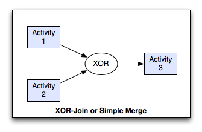
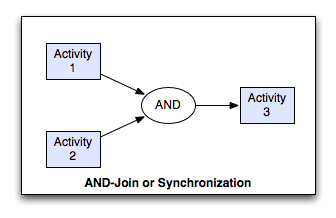
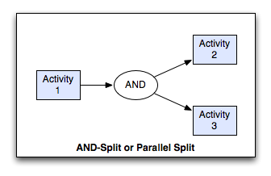

.. rst3: filename: patterns.rst

.. _patterns:

====================
Workflow Patterns
====================

    * Sequence:
        An ActivityInstance is enabled after another ActivityInstance
        in the same ProcessInstance has completed.

    * Parallel Split (AND-Split):
        A point in the ProcessInstance where it splits into several, 
        parallel running ActivityInstances.

    * Exclusive Choice (XOR-Split):
        A point in the Process where ONE of n Transitions evaluates true 
        and creates ONE new ActivityInstance (first-come-first-serve).

    * Synchronisation (AND-Join):
        A point in the ProcessInstance? that needs to wait for all incoming
        Transitions from previous ActivityInstances and then processes
        further.

    * Simple Join (XOR-Join):
        A point in the ProcessInstance that waits for one incoming 
        Transition from an ActivityInstance and then processes further.

    * Loop:
        Repeat a certain sequence of Activities until a condition 
        evaluates true

Sequence Pattern
++++++++++++++++

Description
***********

A task in a process in enabled after the completion of a preceding task in the same process.

Synonyms
********

Sequential routing, serial routing.

Examples
********

The verify-account task executes after the credit card details have been captured.

The codacil-signature task follows the contract-signature task.

A receipt is printed after the train ticket is issued.

Motivation
**********

The Sequence pattern serves as the fundamental building block for processes. It is used to construct a series of consecutive tasks which execute in turn one after the other. Two tasks form part of a Sequence if there is a control-flow edge from one of them to the next which has no guards or conditions associated with it.

XOR-Join Pattern
++++++++++++++++

Description
***********

The convergence of two or more branches into a single subsequent branch such that each enablement of an incoming branch results in the thread of control being passed to the subsequent branch.

Synonyms
********

Simple Merge, XOR-join, exclusive OR-join, asynchronous join, merge.

Examples
********

At the conclusion of either the bobcat-excavation or the D9-excavation tasks, an estimate of the amount of earth moved is made for billing purposes.

After the case-payment or provide-credit tasks, initiate the product-receipt task.

Motivation
**********

The Simple Merge pattern provides a means of merging two or more distinct branches without synchronizing them. As such, this presents the opportunity to simplify a process model by removing the need to explicitly replicate a sequence of tasks that is common to two or more branches. Instead, these branches can be joined with a simple merge construct and the common set of tasks need only to be depicted once in the process model.

XOR-Split Pattern
+++++++++++++++++

Description
***********

The divergence of a branch into two or more branches such that when the incoming branch is enabled, the thread of control is immediately passed to precisely one of the outgoing branches based on a mechanism that can select one of the outgoing branches.

Synonyms
********

Exclusive choice, XOR-split, exclusive OR-split, conditional routing, switch, decision, case statement.

Examples
********

Depending on the volume of earth to be moved, either the dispatch-backhoe, dispatch-bobcat or dispatch-D9-excavator task is initiated to complete the job.

After the review election task is completed, either the declare results or the recount votes task is undertaken.

Motivation
**********

The Exclusive Choice pattern allows the thread of control to be directed to a specific (subsequent) task depending on the outcome of a preceding task, the values of elements of specific data elements in the process, the results of an expression evaluation or some other form of programmatic selection mechanism. The routing decision is made dynamically allowing it to be deferred to the latest possible moment at runtime.

AND-Join Pattern
++++++++++++++++

Description
***********

The convergence of two or more branches into a single subsequent branch such that the thread of control is passed to the subsequent branch when all input branches have been enabled.

Synonyms
********

synchronization, rendezvous, synchronizer.

Examples
********

The dispatch-goods task runs immediately after both the check-invoice and produce-invoice tasks are completed.

Cash-drawer reconciliation can only occur when the store has been closed and the credit card summary has been printed.

Motivation
**********

The AND-join patterns provides a means of reconverging the execution threads of two or more parallel branches. In general, these branches are created using the Parallel Split (AND-split) construct earlier in the process model. The thread of control is passed to the task immediately following the synchronizer once all of the incoming branches have completed.

AND-Split Pattern
+++++++++++++++++

Description
***********

The divergence of a branch into two or more parallel branches each of which execute concurrently.

Synonyms
********

AND-split, parallel routing, parallel split, fork.

Examples
********

After completion of the capture enrolment task, run the create student profile and issue enrolment confirmation tasks simultaneously.

When an intrusion alarm is received, trigger the despatch patrol task and the inform police task immediately.

Once the customer has paid for the goods, pack them and issue a receipt.

Motivation
**********

The AND-Split pattern allows a single thread of execution to be split into two or more branches which can execute tasks concurrently. These branches may or may not be re-synchronized at some future time.

