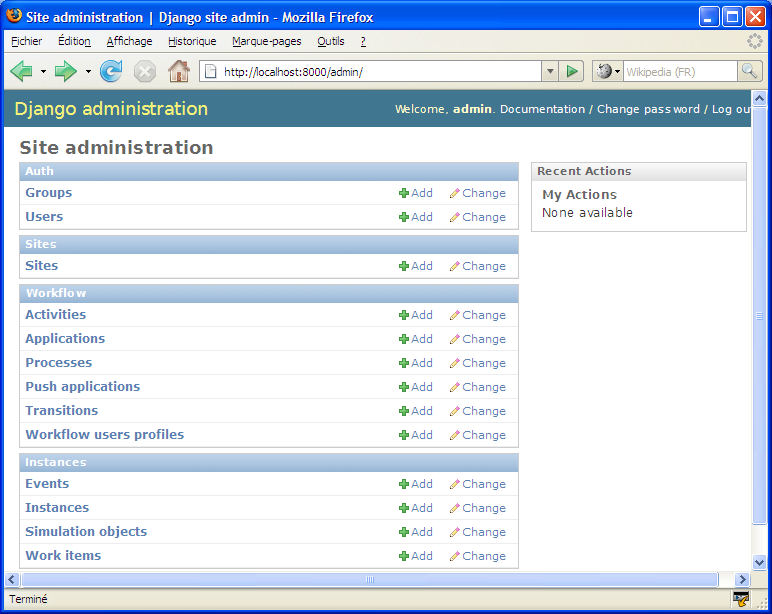
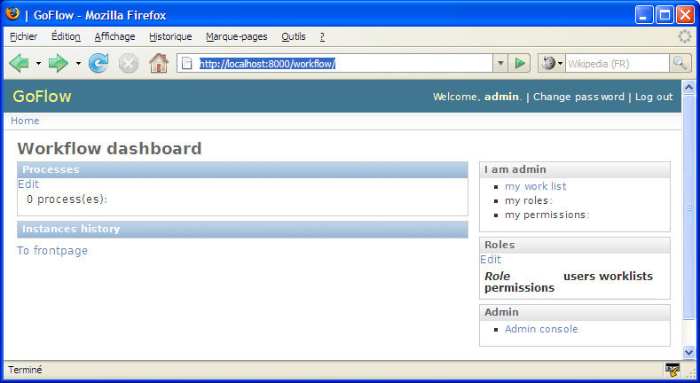
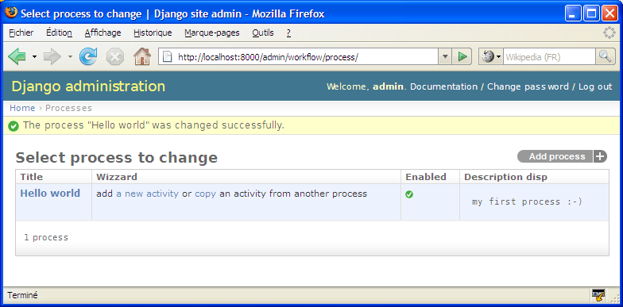

.. rst3: filename: tutorials.rst

.. _tutorial:

==================
GoFlow User Guide
==================

GoFlow is a `django component` which adds activity-based workflow features to a django project.

We'll learn here how to use this module, starting with a very simple "Hello world" django project, and then gradually add features as we go along.

Prerequisites
+++++++++++++

Prerequisite
=================
Create a directory, and copy the directory ``goflow`` to this directory (you can also place it in any directory in your PYTHONPATH).

.. note::
   While the Django documentation advocates the use of absolute paths, the use of relative paths
   in what follows is voluntary. This is done in order to simplify expressions and to be platform 
   independent (and it works, at least under Windows and OS X)

Project "Hello World"
+++++++++++++++++++++

Project "Hello World"
======================
We will discover the workflow engine with a very simple application based on a process workflow with a single activity (a single activity, with no transitions: the simplest possible workflow). The purpose of this activity is to receive a message (for example, "Hello world").

    * Start by creating an empty django project (or use an existing project)::

        Django admin-startproj myproj

    * Add the following applications in the file ``settings.py``::

        INSTALLED_APPS = (
         ...
         'django.contrib.admin'
         'goflow.workflow'
         'goflow.instances'
        )

The `workflow` application contains the "static" model data (modeling
process), and the ``instances`` application contains the dynamic part or runtime.

    * Set up the database part of the settings file, for example like this::

        DATABASE_ENGINE = 'sqlite3'
        DATABASE_NAME = 'data.sqlite'

    * Add the following two lines in the ``urls.py``  file::

        urlpatterns = patterns (``,
         ...

         # Uncomment this for admin:
         (r '^ admin /', include ( 'django.contrib.admin.urls')),
         (r '^ workflow /', include ( 'goflow.urls')),
        )

    * Now create the database server and start it as follows::

        python manage.py syncdb - pythonpath =..
        python manage.py runserver - pythonpath =..

We can now open the console admin [http://localhost:8000/admin], and discover the data models introduced by GoFlow:

We can also discover the GoFlow Dashboard, which provide easy access to the status of workflows using a "back-office" perspective, [http://localhost:8000/workflow]

We will now create a process workflow.

Return to the admin console, add an entity Process as shown with the screen below:

Use "Hello world" for the title, and optionally provide a description of the new process

    * Register using the ``Save button and continue editing``: you can now see that an 
      activity ``End`` was added automatically.

    * Create an initial activity by clicking on the icon "+" in the field ``Initial activity``: 
      enter a title, set the process dropdown to the current process "Hello world", leaving the 
      default values for other fields.

    * Save

We have created our first process workflow:

You may observe that we have not yet specified an application (a url with underlying functionality e.g. views/templates/classes/functions/modules etc..) for our business, and we will shortly see that this is not necessary to begin to "play" with our application.

Indeed, when an activity is not associated with an application, a special testing application is still invoked to simulate this activity: providing a panel to the user, displaying the name, description of the activity, and also a history of the workflow, with an ``OK`` button allowing you to complete the activity.

Before we start running our process workflow, we must first create a ``Group`` with a single permission to allow users to instantiate it:

    * Add a group named ``Hello world``, give it the permission ``can_instantiate`` on the  
      content type ``workflow.process``, and save. (note: the name of the group and the name of 
      the process must be the same)
      
    * Add this group to the current user: this will allow the user to instantiate the process 
      ``Hello world``.

We are now ready to execute/test the workflow: go to the dashboard [http://localhost:8000/workflow]. You will find the process and its definition, and other information on roles and permissions.

    * Click on the link ``start a simulation instance`` under the process ``Hello world``

Let's add an activity
*********************

Let's add our own models
************************

And for some code
*****************

we will implement some forms methods.

Advanced Tutorial
+++++++++++++++++

GoFlow Advanced
============================

Prerequisites
*************

* use goflow svn version as version 0.5 will not work with these tutorials. You can also 
      download the [http://goflow.googlecode.com/files/goflow-0.51.zip v 0.51].
  
    * It is helpful to have a "played" with the demo goflow leave (available online). 
      [http://goflow.alwaysdata.net/leave/]

(tutorial draft; screenshots will be added later)

Application Unit Testing
************************

We will simulate here coding an existing application of the demo ``Leave``: ``hrform``.

    * Launch the local server of the demo ``leave`` in the ``leavedemo`` folder (cf. INSTALL.TXT 
      file)
  
    * Go to the admin console: [http://localhost:8000/leave/admin/]
  
    * Create a !LeaveRequest object: [http://localhost:8000/leave/admin/leave/leaverequest/add/]
        * This object will be used as a model when performing unit tests; hence provide the 
          beginning and end dates, type of absence, the requester (admin), and the reason (e.g 
          "test")
          
    * On the applications panel: [http://localhost:8000/leave/admin/workflow/application/]
    
        * Click on the ``create unit test`` link in the ``hrform`` application row: this will 
          create a process with a single activity that will run the application ``hrform``.
          
        * Click on ``return``
        
        * Click  on the ``start test forums`` link in the ``hrform`` application row; then choose 
          the content type ``leave request`` and click ``OK``: this will initiate as many 
          workflow instances as !LeaveRequest instances that we manually manually before (here, 
          only one).
          
    * Go to the task list of the admin user: [http://localhost:8000/leave/mywork/]
    
    * There must be a task for an activity called ``test_activity`` in the workflow process 
      ``test_hrform``
      
    * Clicking on the link ``activate`` should lead you to the panel corresponding to the 
      implementation of the ``hrform`` application.

Here we have simulated/tested an application in a process workflow; it seems very little, but it is important to have in mind that in the development of complex workflows, and in order to efficiently work in teams, each activity should be coded and tested independently of each other. 

That is why GoFlow is equipped with tools, available in the console admin customized for this purpose, to help the developer generate a test environment for each application.

Application Automation
**********************

We are going to replace an application that currently requires human intervention by an automatic activity. We will work on the previous application ``hrform`` and replace it with the application ``hr_auto`` which will perform the same function but automatically (in fact, this is a simplified version, because calculating the number of days worked between two dates is not trivial).
 
TODO

